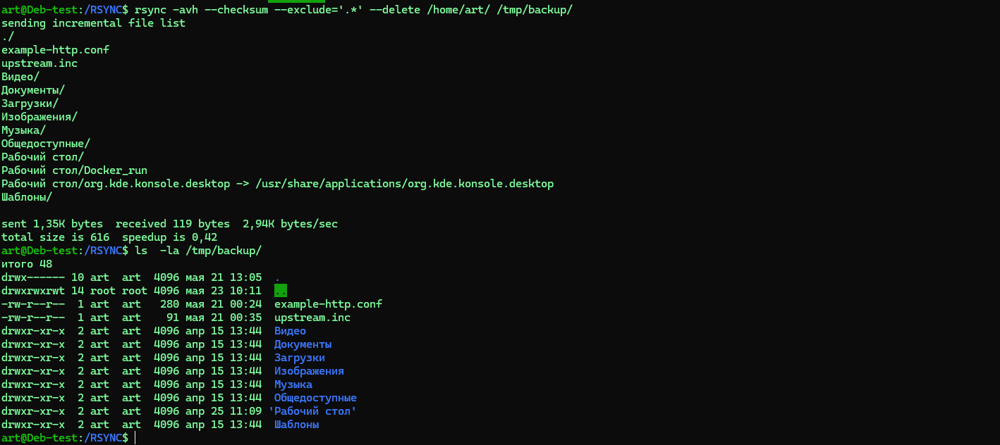
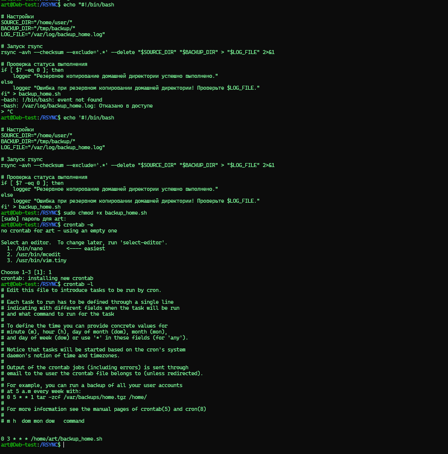
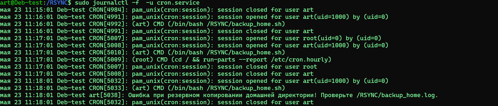
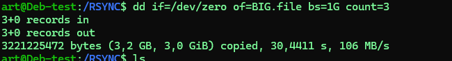
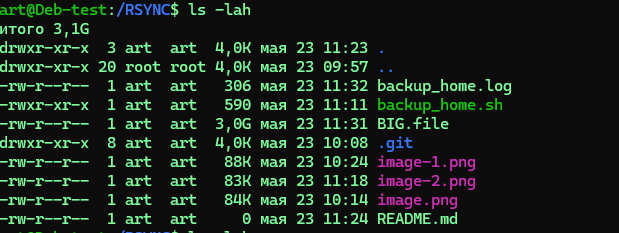
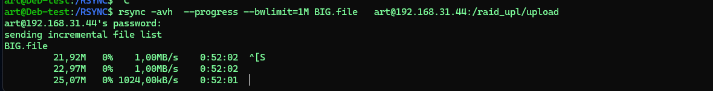
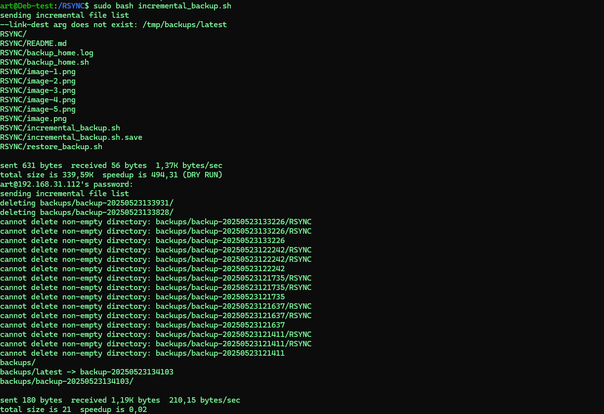
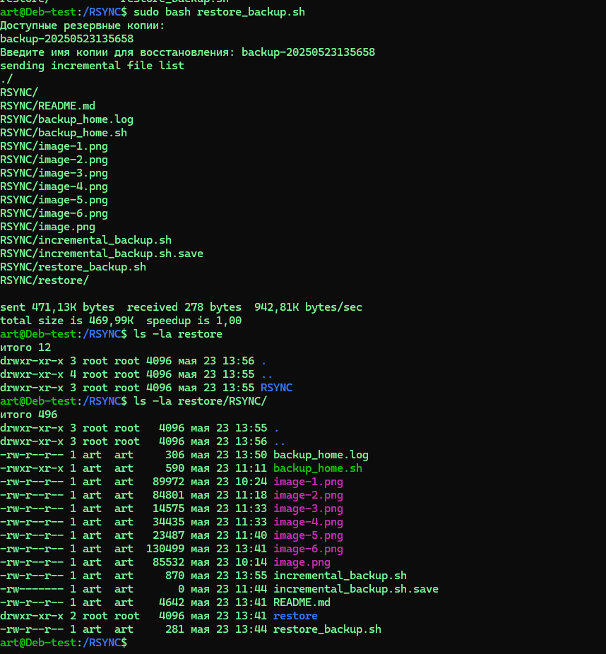

# HOMEWORK_RSYNC


## Задание 1: Зеркальная копия домашней директории с исключением скрытых папок и проверкой хэш-сумм
Команда:

```
rsync -avh --checksum --exclude='.*' --delete /home/user/ /tmp/backup/
```
Опции:

``-a`` – архивный режим (сохраняет права, владельца, временные метки и т. д.);

``-v`` – подробный вывод;

``-h ``– человекочитаемые единицы измерения;

``--checksum`` – проверка хэш-сумм файлов вместо времени и размера;

``--exclude='.*'`` – исключение всех скрытых файлов и папок (начинающихся с точки);

``--delete ``– удаление файлов в приемнике, которых нет в источнике (зеркалирование).

Пример выполнения:

```
rsync -avh --checksum --exclude='.*' --delete /home/user/ /tmp/backup/
```


Еще пример
```
nohup rsync -avh  --ignore-errors --exclude='.*' --progress --partial /mnt/ /home/upload/ 2>&1 >/home/art/RSYNC2.log &
```


## Задание 2: Скрипт для регулярного резервного копирования через cron


1. Создаем скрипт backup_home.sh:

```
#!/bin/bash

# Настройки
SOURCE_DIR="/home/user/"
BACKUP_DIR="/tmp/backup/"
LOG_FILE="backup_home.log"

# Запуск rsync
rsync -avh --checksum --exclude='.*' --delete "$SOURCE_DIR" "$BACKUP_DIR" > "$LOG_FILE" 2>&1

# Проверка статуса выполнения
if [ $? -eq 0 ]; then
    logger "Резервное копирование домашней директории успешно выполнено."
else
    logger "Ошибка при резервном копировании домашней директории! Проверьте $LOG_FILE."
fi
```

2. Даем права на выполнение:

```
sudo chmod +x backup_home.sh
```
3. Настраиваем cron для ежедневного выполнения:
Открываем crontab для текущего пользователя:

```
crontab -e
```
Добавляем строку (например, для выполнения в 3:00 ночи):

```
0 3 * * * /usr/local/bin/backup_home.sh
```
4. Проверяем cron:

```
crontab -l
```




### Задание 3*: Ограничение пропускной способности rsync до 1 Мбит/c
Команда:

```
rsync -avh --bwlimit=1M /path/to/source/ user@remote:/path/to/destination/
--bwlimit=1M – ограничение скорости до 1 Мегабита в секунду.
```

создадим болшой файл для теста файл 
```
 dd if=/dev/zero of=BIG.file bs=1G count=3
```



Пример:

```
rsync -avh --bwlimit=1M BIG.file art@192.168.31.44:/raid_upl
```

(Скриншот с прогрессом передачи и ограничением скорости.)




### Задание 4*: Инкрементное резервное копирование с ротацией и восстановлением
1. Скрипт для инкрементного бэкапа (incremental_backup.sh):
```
#!/bin/bash

SOURCE="/RSYNC"
BACKUP_DIR="/tmp/backups/"
REMOTE="art@192.168.31.44:/raid_upl"
MAX_BACKUPS=5

# Создаем новую резервную копию с меткой времени
TIMESTAMP=$(date +%Y%m%d%H%M%S)
rsync -avh --checksum --link-dest="$BACKUP_DIR/latest" "$SOURCE" "$BACKUP_DIR/backup-$TIMESTAMP"

# Обновляем ссылку 'latest'
rm -f "$BACKUP_DIR/latest"
ln -s "backup-$TIMESTAMP" "$BACKUP_DIR/latest"

# Удаляем старые копии (оставляем только последние MAX_BACKUPS)
cd "$BACKUP_DIR" || exit
ls -td backup-* | tail -n +$((MAX_BACKUPS + 1)) | xargs rm -rf

# Копируем на удаленный сервер (опционально)
rsync -avh --delete "$BACKUP_DIR" "$REMOTE"
```
2. Скрипт для восстановления (restore_backup.sh):

```
#!/bin/bash

BACKUP_DIR="/tmp/backups/"
echo "Доступные резервные копии:"
ls -1 "$BACKUP_DIR" | grep ^backup-

read -p "Введите имя копии для восстановления: " BACKUP_NAME
rsync -avh "$BACKUP_DIR/$BACKUP_NAME/" /home/user/
```

3. Пример работы:

Создаем бэкап:

```
sudo incremental_backup.sh
```



Восстанавливаем:

```
sudo restore_backup.sh
```


